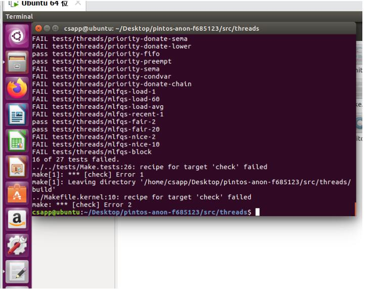

# PintosOS Project1 实验文档

## 任务一	唤醒时钟

### 任务要求

重新实现定义在文件`devices/timer.c`中的函数**`time_sleep()`**

虽然提供了一个工作的实现，但它“忙着等待”，也就是说，它在一个循环中旋转，检查当前时间并调用线程`_yield()`，直到足够的时间过去。

**重新实现它以避免繁忙的等待。**

### 函数分析

#### `time_sleep()`函数

```c
/* Sleeps for approximately TICKS timer ticks.Interrupts must be turned on. */

void
timer_sleep (int64_t ticks) 
{
  int64_t start = timer_ticks ();

  ASSERT (intr_get_level () == INTR_ON);
  while (timer_elapsed (start) < ticks) 
    thread_yield ();
}
```

`timer_sleep`函数在`devices/timer.c`。系统现在是使用`busy wait`实现的，**即线程不停地循环，直到时间片耗尽**。更改`timer_sleep`的实现方式。

为了更好的理解代码实现细节，下面进行逐句解析：

函数传入一个int类型的时间片，进入代码后，第一行定义了一个int类型的start变量，并将其赋值为`timer_ticks()`函数的返回值。


#### `timer_ticks()`函数

```c
/* Returns the number of timer ticks since the OS booted. */

int64_t
timer_ticks (void) 
{
  enum intr_level old_level = intr_disable ();
  int64_t t = ticks;
  intr_set_level (old_level);
  return t;
}
```

> 返回值类型为int类型的函数，根据注释，我们可以发现其功能是：**返回自操作系统启动以来的计时器计时次数**

函数中出现了一个`enum intr_level`，我们找出其定义


#### `enum intr_level`

通过Clion的全文搜索功能，我们可以发现`enum intr_level`定义在`threads/interrupt.h`文件中

```c
/* Interrupts on or off? */

enum intr_level 
{
    INTR_OFF,             /* Interrupts disabled. */
    INTR_ON               /* Interrupts enabled. */
};
```

根据注释，我们能推断出`enum intr_level`就是代表了当前能否被中断的一个数据格式，其中包含了能中断或者不能被中断


#### `intr_disable()`函数

在`threads/interrupt.c`文件中我找到了`intr_disable()`函数的定义

```c
/* Disables interrupts and returns the previous interrupt status. */

enum intr_level
intr_disable (void) 
{
  enum intr_level old_level = intr_get_level ();

  /* Disable interrupts by clearing the interrupt flag.
     See [IA32-v2b] "CLI" and [IA32-v3a] 5.8.1 "Masking Maskable
     Hardware Interrupts". */
  asm volatile ("cli" : : : "memory");

  return old_level;
}
```

> 函数功能：**禁用中断并返回上一个中断状态**

整个函数做了两件事，一个是调用`intr_get_level()`函数，并将其返回值赋值给`old_level`，之后再执行了一行语句：

```c
asm volatile ("cli" : : : "memory");
```

注释：通过清除中断标志来禁用中断，结合语义，这其实是在C语言中调用了汇编指令来实现的禁用中断指令，具体实现细节我们不需要去了解，我们只需要知道这个函数可以禁用中断即可

接下来，我们继续寻找`intr_get_level()`函数


#### `intr_get_level()`函数

函数定义位置：`threads/interrupt.c`

```c
/* Returns the current interrupt status. */

intr_get_level (void) 
{
  uint32_t flags;

  /* Push the flags register on the processor stack, then pop the
     value off the stack into `flags'.  See [IA32-v2b] "PUSHF"
     and "POP" and [IA32-v3a] 5.8.1 "Masking Maskable Hardware
     Interrupts". */
  asm volatile ("pushfl; popl %0" : "=g" (flags));

  return flags & FLAG_IF ? INTR_ON : INTR_OFF;
}
```

> 函数功能：**返回当前中断状态**

`uint32_t`是一种类似于无符号整数的类型（猜测，因为我还没有找到其具体的定义位置）

这下面又是一个汇编指令：

```c
asm volatile ("pushfl; popl %0" : "=g" (flags));
```

具体实现细节我们不需要求了解，只需要知道调用`intr_get_level()`函数就可以返回当前中断状态即可

至此，`timer_ticks ()`函数的调用已经到这里就结束了

我们回顾一下，`time_sleep()`函数调用了`timer_ticks()`函数，其中将函数`inter_disable()`的返回值赋值给了`old_level`，而`inter_disable()`函数的作用是将当前状态设置为不可中断，并返回上一次中断状态，**因此`old_level`中存储的就是上一次的中断状态**

那么之后`old_level`又去哪了呢？我们继续往下看

之后`timer_ticks()`函数执行了：

```c
int64_t t = ticks;
intr_set_level (old_level);
```

`ticks`是定义在`timer.c`文件中的一个全局变量，其定义如下：

```c
/* Number of timer ticks since OS booted. */

static int64_t ticks;
```

注释：**自操作系统启动以来的计时器计时次数**

因此，`t`就是自操作系统启动以来的计时器计时次数

这之后`timer_ticks()`函数又调用了`intr_set_level()`函数，我们来找出该函数的定义


#### `intr_set_level()`函数

函数位置：`threads/interrupt.c`

```c
/* Enables or disables interrupts as specified by LEVEL and
   returns the previous interrupt status. */

enum intr_level
intr_set_level (enum intr_level level) 
{
  return level == INTR_ON ? intr_enable () : intr_disable ();
}
```

> 函数功能：**启用或禁用由级别指定的中断，返回先前的中断状态**

因为`INTR_ON`在`enum intr_level`中就已经定义过为enabled中断，所以如果之前的中断（`level`）是允许中断的 ，就调用`intr_enable()`函数，否则就调用`intr_disable()`函数

那么类似于我们之前讨论的`intr_disable()`函数，`intr_enable()`函数的定义也类似


#### `intr_enable()`函数

函数位置：`threads/interrupt.c`

```c
/* Enables interrupts and returns the previous interrupt status. */

enum intr_level
intr_enable (void) 
{
  enum intr_level old_level = intr_get_level ();
    
  ASSERT (!intr_context ());

  /* Enable interrupts by setting the interrupt flag.

     See [IA32-v2b] "STI" and [IA32-v3a] 5.8.1 "Masking Maskable
     Hardware Interrupts". */
  asm volatile ("sti");

  return old_level;
}
```

> 函数功能：**启用中断并返回上一个中断状态**

其定义类型与`intr_disable()`函数定义类型类似，但是其多了一行断言语句：

```c
ASSERT (!intr_context ());
```


#### `intr_context()`函数

函数位置：`threads/interrupt.c`

```c
/* Returns true during processing of an external interrupt
   and false at all other times. */

bool
intr_context (void) 
{
  return in_external_intr;
}
```

> 函数功能：**在处理外部中断期间返回true，其他时间返回值都是false**

`in_external_intr`是一个全局变量，其定义为：

```c
static bool in_external_intr;   /* Are we processing an external interrupt? */
```

> 这是一个bool类型的变量值，**代表着我们当前是否正在处理外部中断**

因此，只有在我们当前没有正在处理外部中断时，断言才能继续向下运行


因此，`intr_set_level()`函数的作用就是判断之前的中断类型，如果是允许中断，则调用`intr_enable()`函数启用中断并继续返回上一个中断状态，否则调用`intr_disable()`函数


**在返回了总中断次数`t`后，函数`timer_ticks()`执行完毕**

那么，我们回过头来看，函数`timer_ticks()`都做了什么？ 

```c
int64_t timer_ticks (void) 
{
  enum intr_level old_level = intr_disable ();
  int64_t t = ticks;
  intr_set_level (old_level);
  return t;
}
```

通过`intr_disable()`函数使得当前进程无法被中断，怎么样，是不是看到了一丝类似于原子操作的影子，之后将`t`赋值为操作系统自启动以来计时器计时次数，之后再调用函数`intr_set_level()`来根据进入函数`intr_disable()`前的中断状态来还原当前进程的中断状态。**一个禁止中断，一个还原中断状态，这其实就是一个原子操作**，使得在进行操作：

```c
int64_t t = ticks;
```

不会被其他进程打断


**至此，函数`timer_sleep()`第一行语句执行完毕：**

```c
int64_t start = timer_ticks ();
```

**之后，函数`timer_sleep()`执行第二行语句：**

```c
ASSERT (intr_get_level () == INTR_ON);
```

`ASSERT`断言是在前面Debug Tools中的一个函数，这里便不再赘述

这里使得只有当前中断状态为可中断时，函数才能继续向下执行，因为如果当前进程不可中断，下面的while循环：

```c
while (timer_elapsed (start) < ticks) 
    thread_yield ();
```

就可能因为是死循环而且无法被打断，导致程序无法跳出`timer_sleep()`函数


接下来，我们就来看看while循环中的函数`timer_elapsed()`

#### `timer_elapsed()`函数

函数位置：`devices/timer.c`

```c
/* Returns the number of timer ticks elapsed since THEN, which
   should be a value once returned by timer_ticks(). */

int64_t
timer_elapsed (int64_t then) 
{
  return timer_ticks () - then;
}
```

> 函数功能：**返回从then时起经过的计时器计时数，该值为`timer_ticks()`函数返回的值**

因此，**while实质上就是在`ticks`的时间内不断循环执行`thread_yield()`函数**


那么，`thread_yield()`函数是什么呢？

#### `thread_yield()`函数

函数位置：`threads/thread.c`

```c
/* Yields the CPU.  The current thread is not put to sleep and
   may be scheduled again immediately at the scheduler's whim. */

void
thread_yield (void) 
{
  // thread_current()函数功能：返回当前线程起始指针位置
  struct thread *cur = thread_current ();
  enum intr_level old_level;
  
  // 当前线程没有在处理外部中断
  ASSERT (!intr_context ());
  // 禁止中断，并返回上一次中断状态
  old_level = intr_disable ();
  // idle_thread：空闲进程
  if (cur != idle_thread) 
    // 如果当前线程不是空闲的线程就调用list_push_back把当前线程的元素添加到绪队列里面，并把线程改成THREAD_READY（就绪态）状态
    list_push_back (&ready_list, &cur->elem);
  cur->status = THREAD_READY;
  // 调度安排新进程，schedule其实就是拿下一个线程切换过来继续run
  schedule ();
  // 启用或禁用由级别指定的中断，返回先前的中断状态
  intr_set_level (old_level);
}
```

> 函数功能：**让出CPU**

**由于关于线程方面的Pintos源代码中的定义都很复杂，这里我们只是简单研究一下结构，主要记住系统源码中各函数的功能即可**

其实，这其中也进行了原子操作

说的通俗一点，`thread_yield()`函数的功能就是：**把当前线程扔到就绪队列里， 然后重新`schedule()`， 注意这里如果ready队列为空的话当前线程会继续在cpu执行**


> 再回到我们的主函数`time_sleep()`，我们理解了函数后面的调用之后，应该能判断出，while循环做了一件事，**那就是在时间`tisks`内，不断地执行函数`thread_yield()`，将`当前线程`放入线程池中重新洗牌，然后再随机选取一个线程来执行**。
>
> **这其实就是当前函数`time_sleep()`的功能**：`timer_sleep`就是在`ticks`时间内， 如果线程处于`running`状态就不断把他扔到就绪队列不让他执行


**至此，我们整个`time_sleep()`函数功能分析完毕**


#### `time_sleep()`函数设计缺陷

当前的`time_sleep()`函数在时间`tisks`内不断进行while循环，在这个过程中，线程不断地在就绪队列与执行队列中跳转，这会导致长期地占用cpu资源，也就是我们说的忙等待，我们需要完善这个函数的设计，使得起可以被唤醒（因为其调用的函数都是原子操作，无法通过普通的方式唤醒`time_sleep()`函数）


### 设计方案

接下来，我们来逐步分析如何优化与重构这部分代码

> **实现思路**：调用`timer_sleep`的时候直接把线程**阻塞掉**，然后给线程结构体加一个成员`ticks_blocked`来**记录这个线程被sleep了多少时间**， 然后利用操作系统自身的时钟中断（每个tick会执行一次）加入对线程状态的检测， **每次检测将ticks_blocked减1, 如果减到0就唤醒这个线程**。

既然原函数设计的缺点是因为其无休止的将running状态的线程（也就是它自身）放到就绪队列里导致线程的忙等待，那我们就不要让它这样做，我们利用操作系统自身的时钟中断机制来唤醒函数，并亲自将当前线程放到就绪队列中。

函数修改

```c
/* Sleeps for approximately TICKS timer ticks.  Interrupts must
   be turned on. */
void
timer_sleep(int64_t ticks) {
    // ticks小于零直接返回
    if (ticks <= 0) {
        return;
    }
    // 当前中断状态为可中断状态
    ASSERT(intr_get_level() == INTR_ON);
    // 禁用中断，并保存上一个中断状态，使得接下来的操作为原子操作
    enum intr_level old_level = intr_disable();
    // 获取当前线程起始指针位置
    struct thread *current_thread = thread_current();
    // 设置线程休眠时间
    current_thread->ticks_blocked = ticks;
    // 调用线程阻塞函数
    thread_block ();
    // 还原先前的中断状态，停止原子操作
    intr_set_level (old_level);
}
```

这里我调用了`thread_block ()`函数

```c
/* Puts the current thread to sleep.  It will not be scheduled
   again until awoken by thread_unblock().

   This function must be called with interrupts turned off.  It
   is usually a better idea to use one of the synchronization
   primitives in synch.h. */

void
thread_block (void) 
{
  // 函数在处理内部中断
  ASSERT (!intr_context ());
  // 中断禁止状态
  ASSERT (intr_get_level () == INTR_OFF);
  // 将当前线程的状态设置为阻塞状态
  thread_current ()->status = THREAD_BLOCKED;
  // 安排一个新的线程执行
  schedule ();
}
```

> **函数功能**：将当前线程置于睡眠状态。它不会被安排再次执行，直到被函数`unblock()`唤醒。必须在禁止中断情况下调用此函数。

然后我们就需要在`thread.h`文件中加上进程结构体中对于记录休眠时间的成员：

```c
/* Record the time the thread has been blocked. */
int64_t ticks_blocked;
```

然后在线程创建的时候初始化该变量

```c
// thread_creat()
t->ticks_blocked = 0;
```

接下来，我们需要让一开始就休眠的线程在休眠的时候每次都检查自身的`ticks`是否为零，如果为零，则唤醒该线程，因此我们需要一个让所有线程都能执行某个函数的函数，即其形式大致如下：

```c
threads_all_do(func) {
    // all threads do
    func();
}
```

`thread.c`文件中正好为我们定义了这样的函数：

```c
/* Invoke function 'func' on all threads, passing along 'aux'.
   This function must be called with interrupts off. */

void
thread_foreach (thread_action_func *func, void *aux)
{
  struct list_elem *e;

  ASSERT (intr_get_level () == INTR_OFF);

  for (e = list_begin (&all_list); e != list_end (&all_list);
       e = list_next (e))
    {
      struct thread *t = list_entry (e, struct thread, allelem);
      func (t, aux);
    }
}
```

> **函数功能**：在所有线程上调用函数“func”，并传递“aux”。必须在中断关闭时调用此函数。

其中的`for`循环从线程的起始队列一直运行到末尾队列，以此来实现所有线程都执行的功能。

因此，我们只需要向`thread_foreach()`函数传入`func`参数，即可让所有线程都执行`func`函数

我们先定义一个函数，使其可以每次将`ticks--`，并唤醒`ticks == 0`的线程

```c
/* 检查阻塞线程 */
void
thread_check_blocked (struct thread *t, void *aux UNUSED)
{
  // 当前线程状态是已阻塞，并且ticks > 0
  if (t->status == THREAD_BLOCKED && t->ticks_blocked > 0)
  {
      // ticks--
      t->ticks_blocked--;
      // 当ticks == 0时，唤醒线程
      if (t->ticks_blocked == 0)
      {
          // 唤醒线程，thread.c文件中定义的函数，作用是唤醒线程
          thread_unblock(t);
      }
  }
}
```

**千万不要忘了在`thread.h`文件中声明该函数**

```c
// thread.h
void thread_check_blocked (struct thread *t, void *aux UNUSED);
```

最后，在`timer.c`文件中的函数`timer_interrupt()`增加`thread_foreach()`函数即可：

```c
/* Timer interrupt handler. */

static void
timer_interrupt(struct intr_frame *args UNUSED) {
    ticks++;
    thread_tick();
    thread_foreach(thread_check_blocked,NULL);
}
```

**该函数每个时钟周期会自动执行一次。**

至此，我们所需要完成的功能就已经实现了


### 实验疑点

项目中如果加上：

```c
// thread_creat()
t->ticks_blocked = 0;
```

这条语句的话，Pintos系统就会报错：`Unexpected Interrupt`，去掉以后程序正常运行，但是我不知道这行代码为什么会出错，因为创建线程的时候初始化线程的`ticks_blocked`阻塞时间为0是很正常的步骤吧，大概，疑惑中。


### 过点情况


前五个点通过了四个点，第四个测试点因为有关于任务二优先级调度，因此在任务中先不考虑任务二的过点情况，完成。

**一共修改了三个文件：`thread.h`文件，`thread.c`文件，`timer.c`文件。**


## 任务二 优先级调度

### 任务要求

#### 子任务1 实现优先级调度

在原始的代码实现中，线程的就绪队列基本采⽤的是先来先服务的调度⽅式，即先进⼊就绪队列的线程在调度时会

先获得CPU，这个实验的⽬的是将这种调度策略改成优先级调度。即当⼀个线程被添加到就绪列表中，并且该线程

的优先级⾼于当前正在运⾏的线程时，当前线程应该⽴即将处理器交付给新线程。类似地，当有多个线程正在等待

锁、信号量或条件变量时，优先级最⾼的等待线程应该⾸先被唤醒。

在Pintos中，线程优先级范围为0到63。 较低的数字对应较低的优先级，因此优先级 0 是最低优先级，优先级 63

是最⾼优先级。 线程创建时默认的优先级为PRI_DEFAULT = 31。

**注意点：**

在实现优先级调度的时候，不仅仅需要考虑线程的就绪队列，还要考虑信号量和条件变量的等待队列


#### 子任务2	实现优先级捐赠

**优先级捐赠概念：**

在本实验中，优先级捐赠主要是针对线程对于锁的获取的。例如：如果线程H拥有较⾼的优先级，线程M拥有中等

的优先级，线程L拥有较低的优先级。此时若线程H正在等待L持有的锁, 且M⼀直在就绪队列之中，那么线程H将永

远⽆法获得CPU。因此，这个时候需要将H的优先级捐赠给L。

**难点：**

1.⼀个锁只能被单个线程持有，⽽⼀个线程却可以持有多个锁。当线程持有多个锁时，需要将线程的优先级设置

为其被捐赠的优先级中最⼤的。

2.会出现递归捐赠的问题。例如当前存在⼀个⾼优先级线程H，⼀个中优先级线程M，⼀个低优先级线程L。如

果H正在申请M持有的锁，M正在申请L持有的锁，那么M和L的优先级都需要被设置为H的优先级。


### 设计方案

首先找出相关优先级的代码段：（）

 线程成员本身就有一个priority，

thread类定义了：

```
最低优先级为0
public final static int MIN_PRIORITY = 0;

一般没有继承，没有显示指定优先级时，默认优先级为31
public final static int NORM_PRIORITY = 31;

最高优先级为63
public final static int MAX_PRIORITY = 63;
```

这里实现优先级调度的核心思想就是： 维持就绪队列为一个优先级队列。

换一种说法： 我们在插入线程到就绪队列的时候保证这个队列是一个优先级队列即可。

那么我们在什么时候会把一个线程丢到就绪队列中呢？

1. thread_unblock

2. init_thread（非thread_init）

3. thread_yield

那么我们只要在扔的时候维持这个就绪队列是优先级队列即可。

它们都调用了函数`list_push_back`来增加队列中的成员，在`list.c`中我们可以找到此函数的具体实现：直接在队列的队尾插入。

（yield 即 "谦让"，也是 Thread 类的方法。它让掉当前线程 CPU 的时间片，使正在运行中的线程重新变成就绪状态，并重新竞争 CPU 的调度权。它可能会获取到，也有可能被其他线程获取到。）

对于情况一，我们把源码呈上：

```
thread_init (void) 
{
  ASSERT (intr_get_level () == INTR_OFF);//中断函数，判断是否中断，中断则报错（assert为断言函数）

  lock_init (&tid_lock);
  list_init (&ready_list);
  list_init (&all_list);

  /*为正在运行的线程设置一个线程结构。 */
  initial_thread = running_thread ();
  init_thread (initial_thread, "main", PRI_DEFAULT);//出现了init
  initial_thread->status = THREAD_RUNNING;
  initial_thread->tid = allocate_tid ();
}

```

```
thread_unblock (struct thread *t) 
{
  enum intr_level old_level;//这句话接下来会一直用，当成格式

  ASSERT (is_thread (t));

  old_level = intr_disable ();
  ASSERT (t->status == THREAD_BLOCKED);
  list_push_back (&ready_list, &t->elem);//这里放进就绪队列
  t->status = THREAD_READY;
  intr_set_level (old_level);
}
```

```
thread_yield (void) 
{
  struct thread *cur = thread_current ();
  enum intr_level old_level;
  
  ASSERT (!intr_context ());

  old_level = intr_disable ();//关闭中断
  if (cur != idle_thread) 
    list_push_back (&ready_list, &cur->elem);
  cur->status = THREAD_READY;
  schedule ();
  intr_set_level (old_level);
}
```

在/lib/kernel/：有着关系内核函数的定义是我们在实现代码的时候需要参考的

比如list结构

 An empty list looks like this:

                      +------+     +------+
                  <---| head |<--->| tail |--->
                      +------+     +------+

   A list with two elements in it looks like this:

        +------+     +-------+     +-------+     +------+
    <---| head |<--->|   1   |<--->|   2   |<--->| tail |<--->
        +------+     +-------+     +-------+     +------+

这是常见的队列结构。

在其中找找list关于队列管理的函数：（这里我们就不找那些判断list成分的函数了，也不关心普通插入）

```
/* 根据LESS给定的辅助数据AUX对LIST进行排序，自然迭代归并排序，运行时间为O(nlgn)，O(1) LIST中元素个数的空格。 */
list_sort (struct list *list, list_less_func *less, void *aux)
{
  size_t output_run_cnt;        /*当前通过输出的运行次数. */

  ASSERT (list != NULL);
  ASSERT (less != NULL);

  /* 重复传递列表，合并相邻运行的非递减元素，直到只剩下一次运行。 */
  do
    {
      struct list_elem *a0;     /* 第一次跑开始。 */
      struct list_elem *a1b0;   /* 第一圈结束，第二圈开始. */
      struct list_elem *b1;     /* 第二轮结束。 */

      output_run_cnt = 0;
      for (a0 = list_begin (list); a0 != list_end (list); a0 = b1)
        {
          /* 每次迭代产生一次输出运行。 */
          output_run_cnt++;

          /* 定位两列相邻的非递减元素A0……A1B0 A1B0……B1。*/
          a1b0 = find_end_of_run (a0, list_end (list), less, aux);
          if (a1b0 == list_end (list))
            break;
          b1 = find_end_of_run (a1b0, list_end (list), less, aux);

          /* 合并运行 */
          inplace_merge (a0, a1b0, b1, less, aux);
        }
    }
  while (output_run_cnt > 1);

  ASSERT (is_sorted (list_begin (list), list_end (list), less, aux));
}


/* 将ELEM插入到LIST中必须的适当位置，根据LESS给定的辅助数据AUX进行排序。在LIST的元素数量中以O(n)的平均情况运行。 */
void
list_insert_ordered (struct list *list, struct list_elem *elem,
                     list_less_func *less, void *aux)
{
  struct list_elem *e;

  ASSERT (list != NULL);
  ASSERT (elem != NULL);
  ASSERT (less != NULL);

  for (e = list_begin (list); e != list_end (list); e = list_next (e))
    if (less (elem, e, aux))
      break;
  return list_insert (e, elem);
}

/* 遍历LIST并删除除第一个元素外的所有元素
根据LESS，相邻元素相等的集合给定辅助数据AUX。如果DUPLICATES非空，则将LIST中的元素附加到duplicate中。 */
void
list_unique (struct list *list, struct list *duplicates,
             list_less_func *less, void *aux)
{
  struct list_elem *elem, *next;

  ASSERT (list != NULL);
  ASSERT (less != NULL);
  if (list_empty (list))
    return;

  elem = list_begin (list);
  while ((next = list_next (elem)) != list_end (list))
    if (!less (elem, next, aux) && !less (next, elem, aux)) 
      {
        list_remove (next);
        if (duplicates != NULL)
          list_push_back (duplicates, next);
      }
    else
      elem = next;
}


```

直接修改thread_unblock函数把list_push_back改成：

```
list_insert_ordered (&ready_list, &t->elem, (list_less_func *) &thread_cmp_priority, NULL);
```

然后实现一下比较函数thread_cmp_priority（提供控制数据）：

```
 /* priority compare function. */
 bool
 thread_cmp_priority (const struct list_elem *a, const struct list_elem *b, void *aux UNUSED)
 //list_entry表示在找出ptr指向的链表节点所在的type类型的结构体首地址，member是type类型结构体成员。
 {
   return list_entry(a, struct thread, elem)->priority > list_entry(b, struct thread, elem)->priority;
 }
```

然后对thread_yield和thread_init里的list_push_back作同样的修改：

init_thread:

```

```

thread_yield:

```
list_insert_ordered (&ready_list, &cur->elem, (list_less_func *) &thread_cmp_priority, NULL);
```


（具体参数含义暂未研究）

然后我去试一下

alarm_priority这个测试pass了！


然后思考人生，这样实现仅仅是队列排序：

直接TDD吧， 测试驱动开发， 来看测试做了什么：（时间紧任务重，而且我还菜，属实下策）

（这边注意default是默认）


这里的change是指改变优先级进行测试，那么我们先看下面一个测试


抢占式调度的测试， 其实就是在创建一个线程的时候， 如果线程高于当前线程就先执行创建的线程。

测试线程(thread1)创建了一个PRI_DEFAULT+1优先级的内核线程thread2，然后由于thread2优先级高，

所以线程执行直接切换到thread2， thread1阻塞， 然后thread2执行的时候调用的是changing_thread， 又把自身优先级调为PRI_DEFAULT-1,

这个时候thread1的优先级就大于thread2了， 此时thread2阻塞于最后一个msg输出， 线程切换到thread1， 然后thread1又把自己优先级改成PRI_DEFAULT-2,

这个时候thread2又高于thread1了， 所以执行thread2， 然后在输出thread1的msg.

分析这个测试行为我们得出的结论就是： 在设置一个线程优先级要立即重新考虑所有线程执行顺序， 重新安排执行顺序。

那么结论就简单了：在设置新的优先级就必须要重新排线程的顺序（yield）

```
void
thread_set_priority (int new_priority)
 {
   thread_current ()->priority = new_priority;
   thread_yield ();
 }
```

注意了，第一次看没仔细，后来发现了，测试要改变的时候还有创建的时候，因此创建部分我们也得补上（这里是被别人提醒的……）

在thread_create最后把创建的线程unblock了之后加上这些代码：

```
 if (thread_current ()->priority < priority)
   {
     thread_yield ();
 }
```



本来想写一个点，结果两个是一起解决的……

现在完成了建立优先级队列，设置优先级时重排问题,先考虑优先级捐献的问题

这里注意：进入就绪队列仅仅是初步，要注意队列对资源的使用，当发现高优先级的任务因为低优先级任务占用资源而阻塞时，就将低优先级任务的优先级提升到等待它所占有的资源的最高优先级任务的优先级。

然后嘞，没思路了，就TDD吧

看一下donate_one的test

先创建了一个默认优先级的线程，建立一个锁，之后又相继创建1,2，优先级分别高了1,2，并且会检查当前运行的线程的优先级，在这里是建立新的线程因此之前用的抢占式调度就会让acquire1_thread_func发生，

```
acquire1_thread_func (void *lock_) 
 {
   struct lock *lock = lock_;
 
   lock_acquire (lock);
   msg ("acquire1: got the lock");
   lock_release (lock);
   msg ("acquire1: done");
 }
```

先体会一下lock_acquire到底做了什么（又被提醒了……）

```
   sema_down (&lock->semaphore);
  lock->holder = thread_current ();
```

请求了信号量，因此阻塞线程等待释放，


因此确定问题：优先级目前无法影响等待锁的情况，即需要低级的线程执行结束释放锁，那么为了保证优先级原则不被破坏，先把低优先级提高，之后还原。

然后考虑当原来的线程占有了两个锁的情况：（后来发现是priority-donte-multiple）

释放一个锁的时候， 将该锁的拥有者改为该线程被捐赠的第二优先级，若没有其余捐赠者， 则恢复原始优先级。 

 那么**<u>我们的线程必然需要一个数据结构来记录所有对这个（当前）线程有捐赠行为的线程。</u>**

再考虑其他情况，当锁的拥有者不同且相互之间存在抢占关系时（A<B<C,B等A，C等B），那么A的优先级在C创建后要提升到和C相同（逻辑递推），（优先级嵌套）

 我们<u>**线程又需要加一个数据结构， 我们需要获取这个线程被锁于哪个线程。**</u>

先修改thread数据结构， 加入以下成员：

```c
   int base_priority;                  /*基本优先级. */
   struct list locks;                  /* 线程持有的锁。 */
   struct lock *lock_waiting;          /* 线程正在等待的锁。*/
```

然后给synch.h中lock加一下成员：

```c
 struct list_elem elem;      /* 列表元素——用于优先级捐赠。 */
 int max_priority;          /* 获取锁的线程中的最大优先级。 */
```

这么看，有关优先级捐献的需要一起写，尽量不重构，把数据结构一步到位：

看信号量：这里虽然测试文件里面有锁和信号量，主要问题还是信号量，相当于是代码写好了释放锁（我是这么想的，锁本来就是按照信号量实现的），V操作唤醒的顺序也要是优先级高的先，可见 ***信号量的等待队列是优先级队列***

priority-donate-lower这个没太看懂，然后求助了一下：

```c
 thread_set_priority
```


这个在这里被调用了，也就是说，被捐献的线程在过程中被改变了优先级（新问题），要保证逻辑正确。

最后看条件变量->priority-condvar,同样的，要实现等待队列为优先级队列（没错，之前根本没写完优先级队列……）

priority-donate-chain，这个比较难看（lock_pair是包含两个lock指针的结构体，这东西是真的难查到）：

我理解的是，一个线程占有两个相邻的锁，然后像chain一样往后传递，（A占有1,2，B需要2,3，c需要3,4）

```c
 thread_create (name, thread_priority, donor_thread_func, lock_pairs + i);
```

这里详细不在文档说明了，注意，由于每次优先级都在上升，那么donor方法一直会调用

```c
       thread_create (name, thread_priority - 1, interloper_thread_func, NULL);
```

这个……比较迷惑：建立的优先级比上一个循环高，但是小于同循环先创建的，因此不发生抢占（这是测试什么？）

简要总结一下：

```
1.  在一个线程获取一个锁的时候， 如果拥有这个锁的线程优先级比自己低就提高它的优先级，并且如果这个锁还被别的锁锁着， 将会递归地捐赠优先级， 然后在这个线程释放掉这个锁之后恢复未捐赠逻辑下的优先级。

2. 如果一个线程被多个线程捐赠， 维持当前优先级为捐赠优先级中的最大值（acquire和release之时）。

3. 在对一个线程进行优先级设置的时候， 如果这个线程处于被捐赠状态， 则对original_priority进行设置， 然后如果设置的优先级大于当前优先级， 则改变当前优先级， 否则在捐赠状态取消的时候恢复original_priority。

4. 在释放锁对一个锁优先级有改变的时候应考虑其余被捐赠优先级和当前优先级。

5. 将信号量的等待队列实现为优先级队列。

6. 将condition的waiters队列实现为优先级队列。

7. 释放锁的时候若优先级改变则可以发生抢占。
```

修改代码如下：

修改lock_acquire函数：

void
lock_acquire (struct lock *lock)
{
  ASSERT (lock != NULL);
  ASSERT (!intr_context ());
  ASSERT (!lock_held_by_current_thread (lock));

  sema_down (&lock->semaphore);
  lock->holder = thread_current ();//这个就是不符合要求的buddy
}搞成：——————>

```
lock_acquire (struct lock *lock)
  {
    struct thread *current_thread = thread_current ();
    struct lock *l;
    enum intr_level old_level;
  
    ASSERT (lock != NULL);
    ASSERT (!intr_context ());
   ASSERT (!lock_held_by_current_thread (lock));
 /*如果为false(默认值)，则使用轮循调度程序。
如果为真，请使用多级反馈队列调度程序。
由内核命令行选项"-o mlfqs"控制*/
   if (lock->holder != NULL && !thread_mlfqs)
   {
     current_thread->lock_waiting = lock;
     l = lock;
     while (l && current_thread->priority > l->max_priority)
     {
       l->max_priority = current_thread->priority;
       thread_donate_priority (l->holder);
       l = l->holder->lock_waiting;//向前遍历捐献，在P操作之前递归地实现优先级捐赠， 然后在被唤醒之后（此时这个线程已经拥有了这个锁），成为这个锁的拥有者。
     }
   }
 
   sema_down (&lock->semaphore);//P
 
   old_level = intr_disable ();
 
   current_thread = thread_current ();
   if (!thread_mlfqs)//没人用锁，手动实现多级
   {
     current_thread->lock_waiting = NULL;
     lock->max_priority = current_thread->priority;
     thread_hold_the_lock (lock);
   }
  lock->holder = current_thread;
 
   intr_set_level (old_level);
 }
```

```
/* 捐献当前的优先级. */
  void thread_donate_priority (struct thread *t)
  {
    enum intr_level old_level = intr_disable ();
    thread_update_priority (t);
  
    if (t->status == THREAD_READY)
   {
     list_remove (&t->elem);
     list_insert_ordered (&ready_list, &t->elem, thread_cmp_priority, NULL);
   }//先删除t，再按照优先级放到合适的位置
   intr_set_level (old_level);
 }
 /* 获取锁 */
  void
  thread_hold_the_lock(struct lock *lock)
  {
   enum intr_level old_level = intr_disable ();
    list_insert_ordered (&thread_current ()->locks, &lock->elem, lock_cmp_priority, NULL);
  
    if (lock->max_priority > thread_current ()->priority)
    {
     thread_current ()->priority = lock->max_priority;
     thread_yield ();
   }
 
   intr_set_level (old_level);
 }
```

锁队列排序函数lock_cmp_priority:

```c
 bool lock_cmp_priority (const struct list_elem *a, const struct list_elem *b, void *aux)
 {
   return list_entry (a, struct lock, elem)->max_priority > list_entry (b, struct lock, elem)->max_priority;
 }
```

lock realease要：

```c
   if (!thread_mlfqs)
     thread_remove_lock (lock);
```

thread_remove_lock实现如下：

```c
void
 thread_remove_lock (struct lock *lock)
 {
   enum intr_level old_level = intr_disable ();
   list_remove (&lock->elem);
   thread_update_priority (thread_current ());
   intr_set_level (old_level);
 }
 
 //防止锁释放时出现问题，更新优先级
  void
  thread_update_priority (struct thread *t)
  {
    enum intr_level old_level = intr_disable ();
    int max_priority = t->base_priority;//初始优先级
    int lock_priority;
  
    if (!list_empty (&t->locks))//线程还有锁
   {
     list_sort (&t->locks, lock_cmp_priority, NULL);
     lock_priority = list_entry (list_front (&t->locks), struct lock, elem)->max_priority;
     if (lock_priority > max_priority)
       max_priority = lock_priority;
   }
 
   t->priority = max_priority;
   intr_set_level (old_level);
 }
```

这里如果这个线程还有锁， 就先获取这个线程拥有锁的最大优先级（可能被更高级线程捐赠）， 然后如果这个优先级比base_priority大的话更新的应该是被捐赠的优先级。

 然后在init_thread中加入初始化：

```
   t->base_priority = priority;
   list_init (&t->locks);
   t->lock_waiting = NULL;
```

修改一下thread_set_priority：

```c
 void
 thread_set_priority (int new_priority)
 {
   if (thread_mlfqs)
     return;
 
   enum intr_level old_level = intr_disable ();
  
    struct thread *current_thread = thread_current ();
   int old_priority = current_thread->priority;
   current_thread->base_priority = new_priority;
 
   if (list_empty (&current_thread->locks) || new_priority > old_priority)
   {
     current_thread->priority = new_priority;//
     thread_yield ();//
   }
 
   intr_set_level (old_level);
}
```

折腾了那么久，捐献的逻辑坑就填上了，现在问题在信号量，条件变量，锁的等待队列上

老规矩找到cond看亿眼：

void
cond_signal (struct condition *cond, struct lock *lock UNUSED) 
{
  ASSERT (cond != NULL);
  ASSERT (lock != NULL);
  ASSERT (!intr_context ());
  ASSERT (lock_held_by_current_thread (lock));

  if (!list_empty (&cond->waiters)) 
    sema_up (&list_entry (list_pop_front (&cond->waiters),
                          struct semaphore_elem, elem)->semaphore);
}

明显不是优先队列

```
  void
  cond_signal (struct condition *cond, struct lock *lock UNUSED)
  {
    ASSERT (cond != NULL);
    ASSERT (lock != NULL);
    ASSERT (!intr_context ());
   ASSERT (lock_held_by_current_thread (lock));
 
   if (!list_empty (&cond->waiters))
   {
     list_sort (&cond->waiters, cond_sema_cmp_priority, NULL);
     sema_up (&list_entry (list_pop_front (&cond->waiters), struct semaphore_elem, elem)->semaphore);
   }
 }
```

需要比较优先级，因此在这里先建立比较函数：

```c
 bool
 cond_sema_cmp_priority (const struct list_elem *a, const struct list_elem *b, void *aux)
 {
   struct semaphore_elem *sa = list_entry (a, struct semaphore_elem, elem);
   struct semaphore_elem *sb = list_entry (b, struct semaphore_elem, elem);
   return list_entry(list_front(&sa->semaphore.waiters), struct thread, elem)->priority > list_entry(list_front(&sb->semaphore.waiters), struct thread, elem)->priority;
 }
```

然后v操作：

/* 对信号量进行向上或V操作。增加特殊的价值并唤醒一个等待SEMA的线程(如果有的话)。这个函数可以从中断处理程序调用. */
void
sema_up (struct semaphore *sema) 
{
  enum intr_level old_level;

  ASSERT (sema != NULL);

  old_level = intr_disable ();
  if (!list_empty (&sema->waiters)) 
    thread_unblock (list_entry (list_pop_front (&sema->waiters),
                                struct thread, elem));
  sema->value++;
  intr_set_level (old_level);
}

```c
 void
 sema_up (struct semaphore *sema)
 {
   enum intr_level old_level;
 
   ASSERT (sema != NULL);
 
   old_level = intr_disable ();
   if (!list_empty (&sema->waiters))
   {
     list_sort (&sema->waiters, thread_cmp_priority, NULL);
     thread_unblock (list_entry (list_pop_front (&sema->waiters), struct thread, elem));
   }
 
   sema->value++;
   thread_yield ();
   intr_set_level (old_level);
 }
```

sema_down同样更改list_push_back的使用（前面已经提到）

### 实验疑点

中断的使用（未解决）

### 过点情况


## 任务三 高级调度

### 任务要求

在优先级调度策略之中，⾼优先级的进程永远抢占着CPU，⽽低优先级线程能获得的时间⾮常少。在本实验中，我

们会实现更加复杂的调度器，该实验所实现的调度器会⾃动维护线程的优先级。同样的，在任何给定的时间，调度

程序从最⾼优先级的⾮空队列中选择⼀个线程。本实验需要弄清楚以下⼏个概念：

1. ready_threads：代表当前正在处于运⾏态和就绪态的线程的数量

2. load_avg：代表对过去⼀秒钟内准备运⾏的线程的数量的估计，其初始值被设置为0，每⼀秒（100个

ticks），load_avg会进⾏更新。

3. recent_cpu：每⼀个线程都拥有的变量，反应该线程获得cpu的多少。每⼀个ticks，正在运⾏的线程的

recent_cpu会增加1。每⼀秒(100个ticks)，所有的线程的recent_cpu会进⾏更新。

4. nice：代表线程对其他线程的友好程度，取值范围为0到20，nice值为0不会影响该线程的优先级，nice值越

⼤，该线程对其他线程越友好，即该线程的优先级越低，线程创建时初始nice值为0。

5. priority：线程的优先级，每四个ticks，线程的优先级会进⾏更新。

**难点：**

1. 在pintos中，存在⼀个thread_mlfqs的布尔量控制⾼级调度，当其值为true时，使⽤⾼级调度，当值为false

时，使⽤优先级调度。⾼级调度和优先级调度存在少部分冲突，需要特殊判断。

2. 如果前两个任务实现的时间复杂度过⾼，会影响该任务的测试。

3. 使⽤公式计算的优先级可能超出pintos设定的优先级范围(0-63)

4. 在本实验之前请各位确保已经阅读任务三详细⽂档，本实验中涉及到浮点运算的部分都需要使⽤该⽂档中所提

及到的⽅法。


### 设计方案

本实验要进行浮点数运算，但是pintos只有整数运算，需要手动实现。思路是：32位整数的后16位表示小数部分。用这种方法表示的整数x实际上就是x>>16，具体思路就按照官方文档中的写（此处搬运过来了）

```c
Convert n to fixed point:	n * f
Convert x to integer (rounding toward zero):	x / f
(x - f / 2) / f if x <= 0.
Add x and y:	x + y
Subtract y from x:	x - y
Add x and n:	x + n * f
Subtract n from x:	x - n * f
Multiply x by y:	((int64_t) x) * y / f
Multiply x by n:	x * n
Divide x by y:	((int64_t) x) * f / y
Divide x by n:	x / n
```

根据上面规则，用宏定义的方式实现运算，后面计算nice recent_cpu load_avg priority时候所有的运算都调用它们。在thread文件夹下新建fixed_point.h文件。

```c
#ifndef __THREAD_FIXED_POINT_H
#define __THREAD_FIXED_POINT_H

//定义数据类型
typedef int fixed_t;
//小数位数
#define FP_SHIFT_AMOUNT 14
//向fp转换
#define FP_CONST(A) ((fixed_t)(A << FP_SHIFT_AMOUNT))
//两个fp相加
#define FP_ADD(A,B) (A + B)
//整数和fp相加
#define FP_ADD_MIX(A,B) (A + (B << FP_SHIFT_AMOUNT))
//两个fp相减
#define FP_SUB(A,B) (A - B)
//fp减去整数
#define FP_SUB_MIX(A,B) (A - (B << FP_SHIFT_AMOUNT))
//整数和fp相乘
#define FP_MULT_MIX(A,B) (A * B)
//fp类型A被整数B除
#define FP_DIV_MIX(A,B) (A / B)
//两个fp类型数相乘
#define FP_MULT(A,B) ((fixed_t)(((int64_t) A) * B >> FP_SHIFT_AMOUNT))
//两个fp类型数相除
#define FP_DIV(A,B) ((fixed_t)((((int64_t) A) << FP_SHIFT_AMOUNT) / B))
//fp向整数转换
#define FP_INT_PART(A) (A >> FP_SHIFT_AMOUNT)
/* Get rounded integer of a fixed-point value. */
#define FP_ROUND(A) (A >= 0 ? ((A + (1 << (FP_SHIFT_AMOUNT - 1))) >> FP_SHIFT_AMOUNT) \
        : ((A - (1 << (FP_SHIFT_AMOUNT - 1))) >> FP_SHIFT_AMOUNT))

#endif /* thread/fixed_point.h */
```

然后要在thread.h中include "fixed_point.h"

```c
#include "fixed_point.h"
```

根据题目要求，每个ticks程序的recent_cpu加一，每100个ticks要更新线程的recent_cpu和load_avg，每4个ticks更新线程的优先级。修改中断处理函数，每次ticks加一后更新这些值。

下面//包括的部分是添加的代码，里面具体的函数实现在下面有说明。

```c
static void timer_interrupt (struct intr_frame *args UNUSED){
  ticks++;
//////////////////////////////////////////
  if (thread_mlfqs){//判断是否是高级调度
    thread_mlfqs_increase_recent_cpu_by_one ();
    if (ticks % 100 == 0)
      thread_mlfqs_update_load_avg_and_recent_cpu ();
    else if (ticks % 4 == 0)
      thread_mlfqs_update_priority (thread_current ());
  }
/////////////////////////////////////
  thread_tick ();
  thread_foreach(thread_check_blocked,NULL);
}
```

下面是对这几个调用函数的实现，里面涉及的所有运算均采用上面fixed_point中定义好的浮点运算方法。

thread_mlfqs_increase_recent_cpu_by_one (void) 函数，实现让正在运行的线程的recent_cpu加1

```c
void thread_mlfqs_increase_recent_cpu_by_one (void){
  ASSERT (thread_mlfqs);
  ASSERT (intr_context ());
   
  struct thread *current_thread = thread_current ();
  if (current_thread == idle_thread){
    return;
  }
  current_thread->recent_cpu = FP_ADD_MIX (current_thread->recent_cpu, 1);
}
```

thread_mlfqs_update_load_avg_and_recent_cpu（）函数，实现对recent_cpu和load_avg的更新

```c
void thread_mlfqs_update_load_avg_and_recent_cpu (void){
  ASSERT (thread_mlfqs);
  ASSERT (intr_context ());

  size_t ready_threads = list_size (&ready_list);
  if (thread_current () != idle_thread){
    ready_threads++;
  }
  load_avg = FP_ADD (FP_DIV_MIX (FP_MULT_MIX (load_avg, 59), 60), FP_DIV_MIX (FP_CONST (ready_threads),60));

  struct thread *t;
  struct list_elem *e = list_begin (&all_list);
  for (; e != list_end (&all_list); e = list_next (e)){//循环 更新所有线程的recent_cpu和priority
    t = list_entry(e, struct thread, allelem);
    if (t != idle_thread){
      t->recent_cpu = FP_ADD_MIX (FP_MULT (FP_DIV (FP_MULT_MIX (load_avg, 2), FP_ADD_MIX (FP_MULT_MIX (load_avg, 2), 1)), t->recent_cpu), t->nice);
      thread_mlfqs_update_priority (t);
    }
  }
}
```

thread_mlfqs_update_priority (struct thread *t)    实现更新线程优先级的函数

```c
void thread_mlfqs_update_priority (struct thread *t){
  if (t == idle_thread)
    return;
  ASSERT (thread_mlfqs);
  ASSERT (t != idle_thread);
  t->priority = FP_INT_PART (FP_SUB_MIX (FP_SUB (FP_CONST (PRI_MAX), FP_DIV_MIX (t->recent_cpu, 4)), 2 * t->nice));
    //如果修改后priority超出范围就改成边界值
  t->priority = t->priority < PRI_MIN ? PRI_MIN : t->priority;
  t->priority = t->priority > PRI_MAX ? PRI_MAX : t->priority;
}
```

//完善thread.c已经挖好空的函数，用于高级调度中set   nice，get     nice，load_avg，recent_cpu

```c
void
thread_set_nice (int nice)
{
  thread_current ()->nice = nice;
  thread_mlfqs_update_priority (thread_current ());
  thread_yield ();
}
/* Returns the current thread's nice value. */
int
thread_get_nice (void) 
{
  return thread_current ()->nice;
  return 0;
}

/* Returns 100 times the system load average. */
int
thread_get_load_avg (void) 
{
  return FP_ROUND (FP_MULT_MIX (load_avg, 100));
  return 0;
}

/* Returns 100 times the current thread's recent_cpu value. */
int
thread_get_recent_cpu (void) 
{
  return FP_ROUND (FP_MULT_MIX (thread_current ()->recent_cpu, 100));
  return 0;
}
```


然后添加一些高级调度中的用到的变量，priority nice recent_cpu是属于单个线程的，所以加在thread结构体中，load_avg是全局的，所以加载thread.c作为全局变量。具体代码和初始化方法如下。

在thread.h中给thread结构体加入nice和recent_cpu成员

```c
int nice;                          
fixed_t recent_cpu;                 
```

在init_thread中线程初始化时初始化它们的值

```c
t->nice = 0;
t->recent_cpu = FP_CONST (0);
```

在thread.c中声明变量 load_avg

```c
fixed_t load_avg;
```

然后在thread_start中初始化：

```c
load_avg = FP_CONST (0);
```


### 过点情况

完成后运行，所有测试点通过


