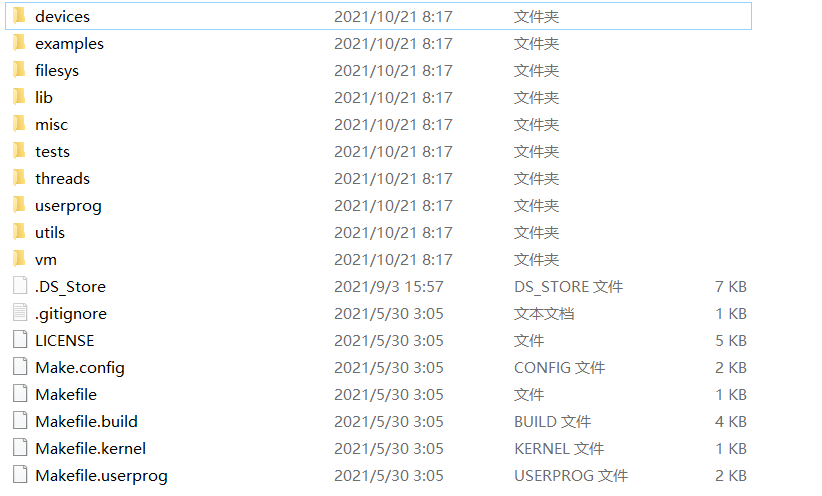
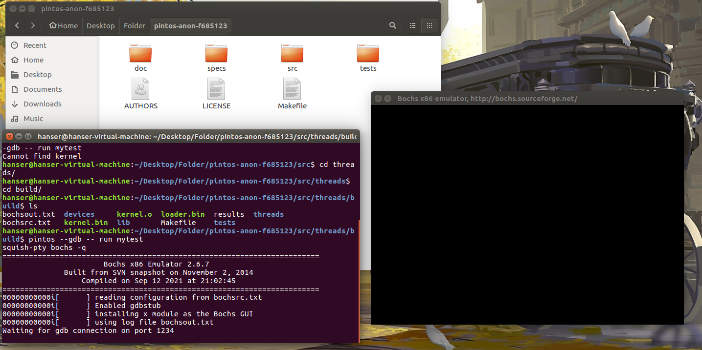
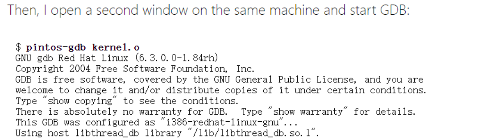
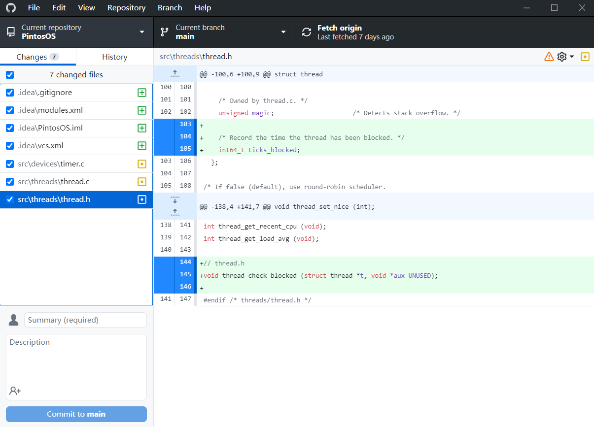

# PintosOS Project1 说明文档

> **19231224 卢恒润**

[TOC]

## PintosOS文件目录结构	

Pintos是美国斯坦福大学操作系统课程的实验项目，作为一个小型操作系统，Pintos实现了进程管理，多线程并发控制，文件系统，虚拟内存等功能，但是这些功能还并不完善，你需要做的就是对这个文件进行相应的代码添加，修改或者删除，如果您能通过所有的测试点，则实验成功。

Pintos文件中我们主要关心src文件夹的目录结构，如下图所示：



| 目录        | 主要负责功能                                                 |
| ----------- | :----------------------------------------------------------- |
| devices/    | I/O设备管理，其中timer.c文件需要在**Project1**中进行修改     |
| examples/   | 从**Project2**开始使用的示例用户程序                         |
| filesys/    | 基本文件系统的源代码，您将从**Project 2**开始使用此文件系统，但在**Project 4**之前不会对其进行修改 |
| lib/        | 标准C库的一个子集的实现。此目录中的代码被编译到Pintos内核中，并且从**Project 2**开始，编译到在其下运行的用户程序中。在内核代码和用户程序中，可以使用`#include<…>`符号包含此目录中的头。**您应该不需要修改此代码** |
| lib/kernel/ | C库中仅包含在Pintos内核中的部分。这还包括一些可以在内核代码中自由使用的数据类型的实现：位图、双链接列表和哈希表。在内核中，可以使用`#include<…>`符号包含此目录中的头 |
| lib/user/   | C库中仅包含在Pintos用户程序中的部分。在用户程序中，可以使用`#include<…>`符号包含此目录中的标题 |
| misc/       | 如果您决定在自己的机器上尝试使用Pintos，这些文件可能会派上用场。否则，**您可以忽略它们** |
| utils/      | 如果您决定在自己的机器上尝试使用Pintos，这些文件可能会派上用场。否则，**您可以忽略它们** |
| tests/      | 每个项目的测试代码，如果此代码有助于测试您的提交，您可以修改此代码，但在运行测试之前，我们会将其替换为原始代码 |
| threads/    | 基本内核的源代码，您将从**Project 1**开始对其进行修改        |
| userprog/   | 用户程序加载器的源代码，您将从**Project 2**开始修改它        |
| vm/         | 几乎是空的目录，您将在**Project 3**中实现虚拟内存            |

参考网址：http://web.stanford.edu/~ouster/cgi-bin/cs140-spring20/pintos/pintos_1.html

对于第一次实验，我们需要修改的文件全部集中在`src/threads`目录和`src/devices`目录之下。

## Pintos Debug Tools

您可以使用许多工具调试Pintos，本节内容向您介绍了其中的一些

### 1 printf()方法

不要低估`printf()`的作用，`printf()`在Pintos中的实现方式是，您几乎可以从内核中的任何位置调用它，无论它是在内核线程中还是在中断处理程序中，几乎不管持有什么锁。


### 2 ASSERT断言

断言是有用的，因为它们可以在问题被发现之前及早发现问题。理想情况下，每个函数应该以一组断言开始，这些断言检查其参数的有效性。（函数的局部变量的初始值设定项在检查断言之前进行评估，因此小心不要假设初始值设定项中的参数有效。）您还可以将断言散布到整个函数体中怀疑可能出错的地方。它们对于检查循环不变量特别有用。
Pintos提供了在`<debug.h>`中定义的ASSERT宏，用于检查断言。

```c
if (CONDITION) {} 
else {
    PANIC ("assertion `%s' failed.", #CONDITION);
}
```

测试表达式的值。如果它的计算结果为零（false），那么内核将陷入恐慌(panic)。紧急消息包括失败的表达式、其文件和行号以及回溯，这将帮助您找到问题。


### 3 宏定义参数

`<debug.h>`中定义的这些宏告诉编译器函数或函数参数的特殊属性。它们的扩展是特定于GCC的。

- **UNUSED**

未使用

附加到函数参数后，告知编译器该参数可能不在函数中使用,它将抑制否则会出现的警告。

- **NO_RETURN**

无返回值

附加到函数原型中，告诉编译器函数永远不会返回。它允许编译器微调其警告和代码生成。

- **NO_INLINE**

无内联

附加到函数原型中，告诉编译器永远不要在线发出函数。有时对提高回溯的质量很有用

- **PRINTF_FORMAT**(format,first)

附加到函数原型后，告诉编译器函数采用类似`printf()`的格式字符串作为参数编号格式（从1开始），并且相应的值参数从第一个编号的参数开始。这让编译器告诉您是否传递了错误的参数类型。


### 4 GDB调试

您可以在GDB调试器的监督下运行Pintos

1 使用`--gdb`选项启动Pintos

注意，终端位置：`src/threads/build`

```shell
pintos --gdb -- run mytest
```

完成这一步后，bochs打开终端调试模式



2 在同一台机器上打开第二个终端，并使用`pintos gdb`调用kernel.o上的`gdb`

```shell
pintos-gdb kernel.o
```

3 输入以下命令

```shell
(gdb) target remote localhost:1234
```

现在GDB通过本地网络连接到模拟器。您现在可以发出任何普通的GDB命令。如果发出`c`命令，模拟BIOS将控制、加载Pintos，然后Pintos将以通常的方式运行。您可以使用Ctrl+C在任意点暂停进程。

> **ps**：按照教程是这么走的，但是我的电脑到第二步后输入指令之后没反应，我也不知道是怎么回事，但利用gdb调试这条路应该走不通了：
>
> 
>
> 正常情况应该是这样的：
>
> 

参考网址：https://web.stanford.edu/class/cs140/projects/pintos/pintos_10.html


------


在本作业中，我们将为您提供一个功能最小的线程系统。您的工作是扩展此系统的功能，以便更好地了解同步问题。

**您将主要在`threads`目录中进行此分配，同时在`devices`目录中进行一些工作。编译应该在`threads`目录中完成。**

## threads部分源代码

您不需要修改大部分代码，但希望通过介绍此概述，您可以开始了解要查看的代码。

| 文件名                        | 文件作用                                                     |
| ----------------------------- | ------------------------------------------------------------ |
| `loader.S` `loader.h`         | 内核加载程序，**您不需要查看或修改此代码**                   |
| `start.S`                     | 在80x86 CPU上执行内存保护和32位操作所需的基本设置。与加载程序不同，此代码实际上是内核的一部分，**您不需要查看或修改此代码** |
| `kernel.lds.S`                | 用于链接内核的链接器脚本。设置内核的加载地址，并将`start.S`安排在内核映像的开头附近。同样，**您不需要查看或修改此代码** |
| `init.c` `init.h`             | 内核初始化，包括`main()`，内核的“主程序”，您至少应该查看`main()`以查看初始化的内容，您可能希望在此处添加自己的初始化代码 |
| `thread.c` `thread.h`         | 基本线程支持，您的大部分工作将在这些文件中进行，`h`定义了`struct-thread`，您可能会在所有四个项目中修改它 |
| `switch.S` `switch.h`         | 用于切换线程的汇编语言例程                                   |
| `palloc.c` `palloc.h`         | 页分配器，以4KB页的倍数分配系统内存                          |
| `malloc.c` `malloc.h`         | 内核的`malloc()`和`free()`的简单实现                         |
| `interrupt.c` `interrupt.h`   | 基本中断处理和用于打开和关闭中断的功能                       |
| `intr-stubs.S` `intr-stubs.h` | 用于低级中断处理的汇编代码                                   |
| `synch.c` `synch.h`           | 基本同步原语：信号量、锁、条件变量和优化障碍，**您将需要在所有四个项目中使用这些同步** |
| `io.h`                        | 用于I/O端口访问的功能。这主要由设备目录中的源代码使用，**您无需触摸这些源代码** |
| `vaddr.h` `pte.h`             | 用于处理虚拟地址和页表项的函数和宏，**在项目3中，这些将对您更加重要，现在，你可以忽略它们** |
| `flags.h`                     | 在80x86“标志”寄存器中定义一些位的宏                          |
| `fixed-point.h`               | 实现定点算法的函数，用于实现高级调度程序                     |

## devices部分源代码

| 文件名                      | 文件作用                                                     |
| --------------------------- | ------------------------------------------------------------ |
| `timer.c` `timer.h`         | 系统计时器，默认情况下每秒滴答100次，**您将在此项目中修改此代码** |
| `vga.c` `vga.h`             | VGA显示驱动程序，负责将文本写入屏幕，**您应该不需要查看此代码**，`printf()`为您调用VGA显示驱动程序，因此没有理由自己调用此代码 |
| `serial.c` `serial.h`       | 串口驱动程序，同样，`printf()`为您调用此代码，**因此您不需要自己这样做** |
| `block.c` `block.h`         | 块设备的抽象层，即随机访问、磁盘状设备，它们被组织为固定大小块的阵列，开箱即用的Pintos支持两种类型的块设备：IDE磁盘和分区，块设备，无论类型如何，**在项目2之前都不会实际使用** |
| `ide.c` `ide.h`             | 最多支持4个IDE磁盘上的读写扇区                               |
| `partition.c` `partition.h` | 了解磁盘上分区的结构，允许将单个磁盘划分为多个区域（分区）以供独立使用 |
| `kbd.c` `kbd.h`             | 键盘驱动程序，处理将其传递到输入层的击键                     |
| `input.c` `input.h`         | 输入层，对键盘或串行驱动程序传递的输入字符进行排队           |
| `intq.c` `intq.h`           | 中断队列，用于管理内核线程和中断处理程序都希望访问的循环队列，由键盘和串行驱动程序使用 |
| `rtc.c` `rtc.h`             | 实时时钟驱动程序，使内核能够确定当前日期和时间，默认情况下，这仅由`thread/init.c`用于为随机数生成器选择初始种子 |
| `speaker.c` `speaker.h`     | 可在PC扬声器上产生铃声的驱动程序                             |
| `pit.c` `pit.h`             | 配置8254可编程中断定时器的代码，此代码由`devices/timer.c`和`devices/speaker.c`使用，因为每个设备都使用PIT的一个输出通道 |

## lib部分源代码

最后，`lib`和`lib/kernel`包含有用的库例程，从**Project 2**开始，用户程序将使用`lib/user`，但它不是内核的一部分

| 文件名                                                       | 文件功能                                                     |
| ------------------------------------------------------------ | ------------------------------------------------------------ |
| `ctype.h` `inttypes.h` `limits.h` `stdarg.h` `stdbool.h` `stddef.h` `stdint.h` `stdio.c` `stdio.h` `stdlib.c` `stdlib.h` `string.c` `string.h` | Pintos内核引入的C语言标准库函数                              |
| `debug.c` `debug.h`                                          | 用于帮助调试的函数和宏                                       |
| `random.c` `random.h`                                        | 伪随机数发生器，随机值的实际顺序不会随Pintos的运行而变化     |
| `round.h`                                                    | 用于舍入的宏                                                 |
| `syscall-nr.h`                                               | 系统呼叫号码，直到**Project 2**才使用                        |
| `kernel/list.c` `kernel/list.h`                              | 双链表实现，在Pintos代码中使用过，**您可能希望自己在Project 1中的一些地方使用它** |
| `kernel/bitmap.c` `kernel/bitmap.h`                          | 位图实现，如果愿意，可以在代码中使用它，**但在Project 1中可能不需要它** |
| `kernel/hash.c` `kernel/hash.h`                              | 哈希表实现，**可能对Project 3有用**                          |
| `kernel/console.c` `kernel/console.h` `kernel/stdio.h`       | 实现`printf()`和其他一些函数                                 |

上述源码部分参考网址：http://web.stanford.edu/~ouster/cgi-bin/cs140-spring20/pintos/pintos_2.html

## 任务一	Alarm Clock

### 任务要求

重新实现定义在文件`devices/timer.c`中的函数**`time_sleep()`**

虽然提供了一个工作的实现，但它“忙着等待”，也就是说，它在一个循环中旋转，检查当前时间并调用线程`_yield()`，直到足够的时间过去。

**重新实现它以避免繁忙的等待。**


### 函数分析

#### `time_sleep()`函数

```c
/* Sleeps for approximately TICKS timer ticks.Interrupts must be turned on. */

void
timer_sleep (int64_t ticks) 
{
  int64_t start = timer_ticks ();

  ASSERT (intr_get_level () == INTR_ON);
  while (timer_elapsed (start) < ticks) 
    thread_yield ();
}
```

`timer_sleep`函数在`devices/timer.c`。系统现在是使用`busy wait`实现的，**即线程不停地循环，直到时间片耗尽**。更改`timer_sleep`的实现方式。

为了更好的理解代码实现细节，下面进行逐句解析：

函数传入一个int类型的时间片，进入代码后，第一行定义了一个int类型的start变量，并将其赋值为`timer_ticks()`函数的返回值。


#### `timer_ticks()`函数

```c
/* Returns the number of timer ticks since the OS booted. */

int64_t
timer_ticks (void) 
{
  enum intr_level old_level = intr_disable ();
  int64_t t = ticks;
  intr_set_level (old_level);
  return t;
}
```

> 返回值类型为int类型的函数，根据注释，我们可以发现其功能是：**返回自操作系统启动以来的计时器计时次数**

函数中出现了一个`enum intr_level`，我们找出其定义


#### `enum intr_level`

通过Clion的全文搜索功能，我们可以发现`enum intr_level`定义在`threads/interrupt.h`文件中

```c
/* Interrupts on or off? */

enum intr_level 
{
    INTR_OFF,             /* Interrupts disabled. */
    INTR_ON               /* Interrupts enabled. */
};
```

根据注释，我们能推断出`enum intr_level`就是代表了当前能否被中断的一个数据格式，其中包含了能中断或者不能被中断


#### `intr_disable()`函数

在`threads/interrupt.c`文件中我找到了`intr_disable()`函数的定义

```c
/* Disables interrupts and returns the previous interrupt status. */

enum intr_level
intr_disable (void) 
{
  enum intr_level old_level = intr_get_level ();

  /* Disable interrupts by clearing the interrupt flag.
     See [IA32-v2b] "CLI" and [IA32-v3a] 5.8.1 "Masking Maskable
     Hardware Interrupts". */
  asm volatile ("cli" : : : "memory");

  return old_level;
}
```

> 函数功能：**禁用中断并返回上一个中断状态**

整个函数做了两件事，一个是调用`intr_get_level()`函数，并将其返回值赋值给`old_level`，之后再执行了一行语句：

```c
asm volatile ("cli" : : : "memory");
```

注释：通过清除中断标志来禁用中断，结合语义，这其实是在C语言中调用了汇编指令来实现的禁用中断指令，具体实现细节我们不需要去了解，我们只需要知道这个函数可以禁用中断即可

接下来，我们继续寻找`intr_get_level()`函数


#### `intr_get_level()`函数

函数定义位置：`threads/interrupt.c`

```c
/* Returns the current interrupt status. */

intr_get_level (void) 
{
  uint32_t flags;

  /* Push the flags register on the processor stack, then pop the
     value off the stack into `flags'.  See [IA32-v2b] "PUSHF"
     and "POP" and [IA32-v3a] 5.8.1 "Masking Maskable Hardware
     Interrupts". */
  asm volatile ("pushfl; popl %0" : "=g" (flags));

  return flags & FLAG_IF ? INTR_ON : INTR_OFF;
}
```

> 函数功能：**返回当前中断状态**

`uint32_t`是一种类似于无符号整数的类型（猜测，因为我还没有找到其具体的定义位置）

这下面又是一个汇编指令：

```c
asm volatile ("pushfl; popl %0" : "=g" (flags));
```

具体实现细节我们不需要求了解，只需要知道调用`intr_get_level()`函数就可以返回当前中断状态即可


至此，`timer_ticks ()`函数的调用已经到这里就结束了

我们回顾一下，`time_sleep()`函数调用了`timer_ticks()`函数，其中将函数`inter_disable()`的返回值赋值给了`old_level`，而`inter_disable()`函数的作用是将当前状态设置为不可中断，并返回上一次中断状态，**因此`old_level`中存储的就是上一次的中断状态**

那么之后`old_level`又去哪了呢？我们继续往下看

之后`timer_ticks()`函数执行了：

```c
int64_t t = ticks;
intr_set_level (old_level);
```

`ticks`是定义在`timer.c`文件中的一个全局变量，其定义如下：

```c
/* Number of timer ticks since OS booted. */

static int64_t ticks;
```

注释：**自操作系统启动以来的计时器计时次数**

因此，`t`就是自操作系统启动以来的计时器计时次数

这之后`timer_ticks()`函数又调用了`intr_set_level()`函数，我们来找出该函数的定义


#### `intr_set_level()`函数

函数位置：`threads/interrupt.c`

```c
/* Enables or disables interrupts as specified by LEVEL and
   returns the previous interrupt status. */

enum intr_level
intr_set_level (enum intr_level level) 
{
  return level == INTR_ON ? intr_enable () : intr_disable ();
}
```

> 函数功能：**启用或禁用由级别指定的中断，返回先前的中断状态**

因为`INTR_ON`在`enum intr_level`中就已经定义过为enabled中断，所以如果之前的中断（`level`）是允许中断的 ，就调用`intr_enable()`函数，否则就调用`intr_disable()`函数

那么类似于我们之前讨论的`intr_disable()`函数，`intr_enable()`函数的定义也类似


#### `intr_enable()`函数

函数位置：`threads/interrupt.c`

```c
/* Enables interrupts and returns the previous interrupt status. */

enum intr_level
intr_enable (void) 
{
  enum intr_level old_level = intr_get_level ();
    
  ASSERT (!intr_context ());

  /* Enable interrupts by setting the interrupt flag.

     See [IA32-v2b] "STI" and [IA32-v3a] 5.8.1 "Masking Maskable
     Hardware Interrupts". */
  asm volatile ("sti");

  return old_level;
}
```

> 函数功能：**启用中断并返回上一个中断状态**

其定义类型与`intr_disable()`函数定义类型类似，但是其多了一行断言语句：

```c
ASSERT (!intr_context ());
```


#### `intr_context()`函数

函数位置：`threads/interrupt.c`

```c
/* Returns true during processing of an external interrupt
   and false at all other times. */

bool
intr_context (void) 
{
  return in_external_intr;
}
```

> 函数功能：**在处理外部中断期间返回true，其他时间返回值都是false**

`in_external_intr`是一个全局变量，其定义为：

```c
static bool in_external_intr;   /* Are we processing an external interrupt? */
```

> 这是一个bool类型的变量值，**代表着我们当前是否正在处理外部中断**

因此，只有在我们当前没有正在处理外部中断时，断言才能继续向下运行


因此，`intr_set_level()`函数的作用就是判断之前的中断类型，如果是允许中断，则调用`intr_enable()`函数启用中断并继续返回上一个中断状态，否则调用`intr_disable()`函数


**在返回了总中断次数`t`后，函数`timer_ticks()`执行完毕**

那么，我们回过头来看，函数`timer_ticks()`都做了什么？ 

```c
int64_t timer_ticks (void) 
{
  enum intr_level old_level = intr_disable ();
  int64_t t = ticks;
  intr_set_level (old_level);
  return t;
}
```

通过`intr_disable()`函数使得当前进程无法被中断，怎么样，是不是看到了一丝类似于原子操作的影子，之后将`t`赋值为操作系统自启动以来计时器计时次数，之后再调用函数`intr_set_level()`来根据进入函数`intr_disable()`前的中断状态来还原当前进程的中断状态。**一个禁止中断，一个还原中断状态，这其实就是一个原子操作**，使得在进行操作：

```c
int64_t t = ticks;
```

不会被其他进程打断


**至此，函数`timer_sleep()`第一行语句执行完毕：**

```c
int64_t start = timer_ticks ();
```

**之后，函数`timer_sleep()`执行第二行语句：**

```c
ASSERT (intr_get_level () == INTR_ON);
```

`ASSERT`断言是在前面Debug Tools中的一个函数，这里便不再赘述

这里使得只有当前中断状态为可中断时，函数才能继续向下执行，因为如果当前进程不可中断，下面的while循环：

```c
while (timer_elapsed (start) < ticks) 
    thread_yield ();
```

就可能因为是死循环而且无法被打断，导致程序无法跳出`timer_sleep()`函数


接下来，我们就来看看while循环中的函数`timer_elapsed()`


#### `timer_elapsed()`函数

函数位置：`devices/timer.c`

```c
/* Returns the number of timer ticks elapsed since THEN, which
   should be a value once returned by timer_ticks(). */

int64_t
timer_elapsed (int64_t then) 
{
  return timer_ticks () - then;
}
```

> 函数功能：**返回从then时起经过的计时器计时数，该值为`timer_ticks()`函数返回的值**


因此，**while实质上就是在`ticks`的时间内不断循环执行`thread_yield()`函数**


那么，`thread_yield()`函数是什么呢？


#### `thread_yield()`函数

函数位置：`threads/thread.c`

```c
/* Yields the CPU.  The current thread is not put to sleep and
   may be scheduled again immediately at the scheduler's whim. */

void
thread_yield (void) 
{
  // thread_current()函数功能：返回当前线程起始指针位置
  struct thread *cur = thread_current ();
  enum intr_level old_level;
  
  // 当前线程没有在处理外部中断
  ASSERT (!intr_context ());
  // 禁止中断，并返回上一次中断状态
  old_level = intr_disable ();
  // idle_thread：空闲进程
  if (cur != idle_thread) 
    // 如果当前线程不是空闲的线程就调用list_push_back把当前线程的元素添加到绪队列里面，并把线程改成THREAD_READY（就绪态）状态
    list_push_back (&ready_list, &cur->elem);
  cur->status = THREAD_READY;
  // 调度安排新进程，schedule其实就是拿下一个线程切换过来继续run
  schedule ();
  // 启用或禁用由级别指定的中断，返回先前的中断状态
  intr_set_level (old_level);
}
```

> 函数功能：**让出CPU**

**由于关于线程方面的Pintos源代码中的定义都很复杂，这里我们只是简单研究一下结构，主要记住系统源码中各函数的功能即可**

其实，这其中也进行了原子操作

说的通俗一点，`thread_yield()`函数的功能就是：**把当前线程扔到就绪队列里， 然后重新`schedule()`， 注意这里如果ready队列为空的话当前线程会继续在cpu执行**


> 再回到我们的主函数`time_sleep()`，我们理解了函数后面的调用之后，应该能判断出，while循环做了一件事，**那就是在时间`tisks`内，不断地执行函数`thread_yield()`，将`当前线程`放入线程池中重新洗牌，然后再随机选取一个线程来执行**。
>
> **这其实就是当前函数`time_sleep()`的功能**：`timer_sleep`就是在`ticks`时间内， 如果线程处于`running`状态就不断把他扔到就绪队列不让他执行


**至此，我们整个`time_sleep()`函数功能分析完毕**


#### `time_sleep()`函数设计缺陷

当前的`time_sleep()`函数在时间`tisks`内不断进行while循环，在这个过程中，线程不断地在就绪队列与执行队列中跳转，这会导致长期地占用cpu资源，也就是我们说的忙等待，我们需要完善这个函数的设计，使得起可以被唤醒（因为其调用的函数都是原子操作，无法通过普通的方式唤醒`time_sleep()`函数）


### 实验设计思路

接下来，我们来逐步分析如何优化与重构这部分代码

> **实现思路**：调用`timer_sleep`的时候直接把线程**阻塞掉**，然后给线程结构体加一个成员`ticks_blocked`来**记录这个线程被sleep了多少时间**， 然后利用操作系统自身的时钟中断（每个tick会执行一次）加入对线程状态的检测， **每次检测将ticks_blocked减1, 如果减到0就唤醒这个线程**。

既然原函数设计的缺点是因为其无休止的将running状态的线程（也就是它自身）放到就绪队列里导致线程的忙等待，那我们就不要让它这样做，我们利用操作系统自身的时钟中断机制来唤醒函数，并亲自将当前线程放到就绪队列中。

函数修改

```c
/* Sleeps for approximately TICKS timer ticks.  Interrupts must
   be turned on. */
void
timer_sleep(int64_t ticks) {
    // ticks小于零直接返回
    if (ticks <= 0) {
        return;
    }
    // 当前中断状态为可中断状态
    ASSERT(intr_get_level() == INTR_ON);
    // 禁用中断，并保存上一个中断状态，使得接下来的操作为原子操作
    enum intr_level old_level = intr_disable();
    // 获取当前线程起始指针位置
    struct thread *current_thread = thread_current();
    // 设置线程休眠时间
    current_thread->ticks_blocked = ticks;
    // 调用线程阻塞函数
    thread_block ();
    // 还原先前的中断状态，停止原子操作
    intr_set_level (old_level);
}
```

这里我调用了`thread_block ()`函数

```c
/* Puts the current thread to sleep.  It will not be scheduled
   again until awoken by thread_unblock().

   This function must be called with interrupts turned off.  It
   is usually a better idea to use one of the synchronization
   primitives in synch.h. */

void
thread_block (void) 
{
  // 函数在处理内部中断
  ASSERT (!intr_context ());
  // 中断禁止状态
  ASSERT (intr_get_level () == INTR_OFF);
  // 将当前线程的状态设置为阻塞状态
  thread_current ()->status = THREAD_BLOCKED;
  // 安排一个新的线程执行
  schedule ();
}
```

> **函数功能**：将当前线程置于睡眠状态。它不会被安排再次执行，直到被函数`unblock()`唤醒。必须在禁止中断情况下调用此函数。

然后我们就需要在`thread.h`文件中加上进程结构体中对于记录休眠时间的成员：

```c
/* Record the time the thread has been blocked. */
int64_t ticks_blocked;
```

然后在线程创建的时候初始化该变量

```c
// thread_creat()
t->ticks_blocked = 0;
```

接下来，我们需要让一开始就休眠的线程在休眠的时候每次都检查自身的`ticks`是否为零，如果为零，则唤醒该线程，因此我们需要一个让所有线程都能执行某个函数的函数，即其形式大致如下：

```c
threads_all_do(func) {
    // all threads do
    func();
}
```

`thread.c`文件中正好为我们定义了这样的函数：

```c
/* Invoke function 'func' on all threads, passing along 'aux'.
   This function must be called with interrupts off. */

void
thread_foreach (thread_action_func *func, void *aux)
{
  struct list_elem *e;

  ASSERT (intr_get_level () == INTR_OFF);

  for (e = list_begin (&all_list); e != list_end (&all_list);
       e = list_next (e))
    {
      struct thread *t = list_entry (e, struct thread, allelem);
      func (t, aux);
    }
}
```

> **函数功能**：在所有线程上调用函数“func”，并传递“aux”。必须在中断关闭时调用此函数。

其中的`for`循环从线程的起始队列一直运行到末尾队列，以此来实现所有线程都执行的功能。

因此，我们只需要向`thread_foreach()`函数传入`func`参数，即可让所有线程都执行`func`函数

我们先定义一个函数，使其可以每次将`ticks--`，并唤醒`ticks == 0`的线程

```c
/* 检查阻塞线程 */

void
thread_check_blocked (struct thread *t, void *aux UNUSED)
{
  // 当前线程状态是已阻塞，并且ticks > 0
  if (t->status == THREAD_BLOCKED && t->ticks_blocked > 0)
  {
      // ticks--
      t->ticks_blocked--;
      // 当ticks == 0时，唤醒线程
      if (t->ticks_blocked == 0)
      {
          // 唤醒线程，thread.c文件中定义的函数，作用是唤醒线程
          thread_unblock(t);
      }
  }
}
```

**千万不要忘了在`thread.h`文件中声明该函数**

```c
// thread.h
void thread_check_blocked (struct thread *t, void *aux UNUSED);
```

最后，在`timer.c`文件中的函数`timer_interrupt()`增加`thread_foreach()`函数即可：

```c
/* Timer interrupt handler. */

static void
timer_interrupt(struct intr_frame *args UNUSED) {
    ticks++;
    thread_tick();
    thread_foreach(thread_check_blocked,NULL);
}
```

**该函数每个时钟周期会自动执行一次。**

至此，我们所需要完成的功能就已经实现了

### 重要提醒

项目中如果加上：

```c
// thread_creat()
t->ticks_blocked = 0;
```

这条语句的话，Pintos系统就会报错：`Unexpected Interrupt`，去掉以后程序正常运行，但是我不知道这行代码为什么会出错，因为创建线程的时候初始化线程的`ticks_blocked`阻塞时间为0是很正常的步骤吧，大概，疑惑中。

### 任务一过点情况


前五个点通过了四个点，第四个测试点因为有关于任务二优先级调度，因此在任务中先不考虑任务二的过点情况，完成。

**一共修改了三个文件：`thread.h`文件，`thread.c`文件，`timer.c`文件。**

具体修改文件内容可以在我们的`github`仓库地址中查看，仓库地址：https://github.com/19231224lhr/Pintos



